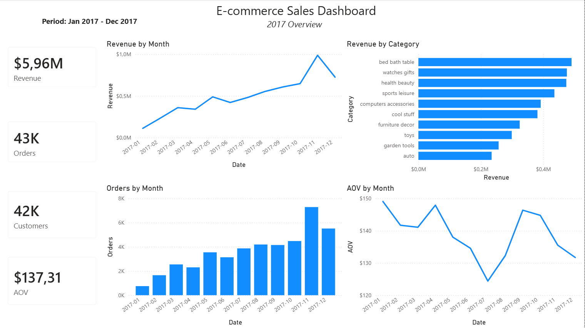
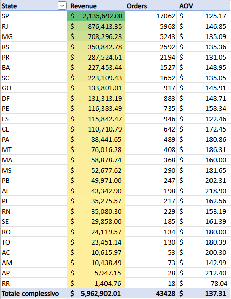

# E-commerce Sales and Customer Analysis

## Project Overview

This portfolio project uses the Olist Brazilian E-commerce dataset to build a clean analytical layer with Python, validate it with SQL, and deliver reporting outputs in SQL, Power BI, and Excel.

The project focuses on:
- Python ETL for clean-layer preparation
- SQL analysis
- relational data modeling
- validation checks
- KPI consistency
- structured reporting outputs

It was designed to demonstrate practical foundations in Python for tabular data transformation, SQL, relational data modeling, data validation, and downstream reporting.

---

## Business Goal

After building a consistent analytical layer, the project aims to answer questions such as:
- How did sales evolve month by month in 2017?
- Which product categories generated the highest revenue?
- How many orders and customers contributed to sales performance?
- What customer behavior patterns can be identified from order history?

---

## Dataset

Source dataset: **Olist Brazilian E-commerce Public Dataset**

Main entities used in the project:
- customers
- orders
- order_items
- products
- product category translation table

The project uses a clean analytical layer built from raw CSV files before running SQL analysis.

---

## Analytical Scope

This project focuses on **2017** and uses a **delivered-only KPI scope** for the main business metrics.

Core KPI logic:
- **Revenue** = sum of `order_items.price`
- **Orders** = delivered orders only
- **Customers** = customers with delivered orders only
- **AOV** = delivered revenue / delivered orders

This choice keeps all core business KPIs aligned to the same population of completed orders.

---

## Key Business Assumptions

### 1. Revenue definition
Revenue is defined as the sum of `order_items.price`.

Notes:
- shipping costs are not included
- payment installments are not used as revenue
- item-level price is the main sales measure

### 2. Delivered-only KPI scope
Main KPI analysis is restricted to orders with `order_status = 'delivered'`.

This avoids mixing completed sales with non-delivered orders that may still have rows in `order_items`.

### 3. Customer identifier
In the analytical layer, `customer_unique_id` is used as the customer identifier.

This simplifies customer-level analysis by resolving the raw `customer_id -> customer_unique_id` mapping once during the clean-layer build step.

### 4. Customer location assumption
The cleaned `customers` table keeps one row per unique customer.

In the Python ETL step, duplicate raw customer records are collapsed to one row per `customer_unique_id`, while retaining the customer location fields needed for downstream analysis.

### 5. Category translation fallback
Product categories are translated to English when a matching translation is available.

If no translation is found, the original raw category value is kept as a fallback instead of dropping the product.

---

## Project Structure

```text
ecommerce-sales-customer-analysis/
├─ 00_python/
│  └─ 00_build_clean_layer.py
├─ 01_sql/
│  ├─ 01_data_checks.sql
│  ├─ 02_core_kpis.sql
│  └─ 03_customer_analysis.sql
├─ 02_powerbi/
│  └─ ecommerce_dashboard.pbix
├─ 03_excel/
│  └─ e_commerce_excel.xlsx
├─ 04_data/
│  ├─ cleaned/
│  │  ├─ customers.csv
│  │  ├─ order_items.csv
│  │  ├─ orders.csv
│  │  └─ products.csv
│  └─ raw/
│     ├─ olist_customers_dataset.csv
│     ├─ olist_order_items_dataset.csv
│     ├─ olist_orders_dataset.csv
│     ├─ olist_products_dataset.csv
│     └─ product_category_name_translation.csv
├─ 05_images/
│  ├─ dashboard_powerbi.png
│  └─ pivot_table_excel.png
└─ README.md
```

---

## Data Flow

The project follows this workflow:

1. Raw CSV files are stored in `04_data/raw/`.
2. A Python ETL script builds the cleaned analytical layer.
3. The cleaned tables are loaded into MySQL.
4. SQL checks validate the cleaned layer and support the analytical scope.
5. KPI and customer analysis queries are built on top of the cleaned tables.
6. Power BI and Excel consume the final business-ready output.

The Python ETL step replaces the previous SQL-view creation approach without changing the downstream business logic, so the SQL, Power BI, and Excel outputs remain conceptually aligned.

---

## Python Showcase

Below is one example of the Python ETL logic used in the project to build the cleaned analytical layer from raw CSV files.

This function rebuilds the `orders` table by resolving the raw `customer_id -> customer_unique_id` mapping, validating expected order status values, parsing order dates, and returning a cleaned output ready for downstream SQL analysis.

```python
def build_orders(raw_orders, raw_customers):
    customer_bridge = raw_customers[[
        "customer_id",
        "customer_unique_id"
    ]].copy()

    orders = raw_orders.merge(
        customer_bridge,
        on="customer_id",
        how="left"
    )

    orders = orders[[
        "order_id",
        "customer_unique_id",
        "order_purchase_timestamp",
        "order_status"
    ]].copy()

    orders["order_status"] = orders["order_status"].astype(str).str.strip()

    expected_statuses = {
        "created",
        "approved",
        "invoiced",
        "processing",
        "shipped",
        "delivered",
        "canceled",
        "unavailable"
    }

    invalid_status_count = (~orders["order_status"].isin(expected_statuses)).sum()

    orders["order_purchase_timestamp"] = pd.to_datetime(
        orders["order_purchase_timestamp"],
        errors="coerce"
    )

    invalid_order_date_count = orders["order_purchase_timestamp"].isna().sum()

    orders = orders.dropna(
        subset=["customer_unique_id", "order_purchase_timestamp"]
    ).copy()

    orders = orders.rename(columns={
        "customer_unique_id": "customer_id",
        "order_purchase_timestamp": "order_date"
    })

    return orders, invalid_status_count, invalid_order_date_count
```

This ETL step complements the SQL layer by handling file-based preprocessing, field validation, and analytical key resolution before downstream KPI and customer analysis.

---

## Python ETL Layer

The clean analytical layer is built with `00_python/00_build_clean_layer.py`.

The script reads the raw CSV files and creates four cleaned outputs:
- `customers.csv`
- `orders.csv`
- `order_items.csv`
- `products.csv`

The ETL step includes:
- customer deduplication at `customer_unique_id` level
- raw `customer_id -> customer_unique_id` resolution for the orders layer
- numeric validation of `price`
- removal of invalid or non-positive item prices
- trimming of text fields used in the analytical layer
- product category translation with fallback to the original value when translation is missing
- summary counts printed at runtime

This step makes the flow more explicit from a data engineering perspective: Python prepares the clean layer, while SQL validates and analyzes it.

---

## SQL Showcase

Below is one example of the SQL logic used in the project to transform validated transactional data into customer-level analytical output.

This query aggregates delivered orders at customer-month level for 2017, then uses a window function to compare each customer's last active month with the previous one.

```sql
-- Query example: customers whose last active month revenue in 2017
-- is greater than their previous active month revenue

with customer_month_2017 as (
select
    o.customer_id,
    date_format(o.order_date, '%Y-%m') as order_month,
    sum(oi.price) as month_revenue
from orders o
join order_items oi
    on oi.order_id = o.order_id
where o.order_date >= '2017-01-01'
    and o.order_date < '2018-01-01'
    and o.order_status = 'delivered'
group by o.customer_id, date_format(o.order_date, '%Y-%m')
),
month_with_lag as (
select
    customer_id,
    order_month,
    month_revenue,
    row_number() over (partition by customer_id order by order_month desc) as rn,
    lag(month_revenue) over (partition by customer_id order by order_month) as prev_month_revenue
from customer_month_2017
)
select
    customer_id,
    order_month as last_active_month,
    month_revenue as last_active_month_revenue,
    prev_month_revenue
from month_with_lag
where rn = 1
    and prev_month_revenue is not null
    and month_revenue > prev_month_revenue;
```

---

## SQL Layer and Analysis

The SQL part of the project is organized into three files:

### `01_data_checks.sql`
Runs validation checks before KPI analysis.

The checks cover:
- duplicate keys in core analytical tables
- critical null values
- invalid item prices
- orphan records across joins
- orders without matching `order_items`
- final row counts by table

### `02_core_kpis.sql`
Calculates the main business KPIs for the 2017 delivered-order scope.

The file includes queries for:
- total delivered revenue in 2017
- monthly delivered revenue
- monthly delivered orders
- revenue by category
- average order value by month
- non-delivered orders with items, grouped by status

### `03_customer_analysis.sql`
Explores customer-level behavior for 2017.

The analysis includes:
- one-time vs repeat customers
- top 10 customers by revenue
- customers active in H1 but inactive in H2
- customers with H2 AOV higher than H1 AOV
- customers whose last active month outperformed the previous one
- customers whose top category accounts for more than 50% of their revenue

### SQL design notes
Particular attention was given to:
- analytical grain
- separation between data preparation and business analysis
- consistent business definitions across SQL, Power BI, and Excel
- readable multi-step logic with CTEs where needed
- validation of the cleaned layer before downstream reporting

---

## Reporting Output - Power BI

The Power BI dashboard is built on top of the cleaned SQL layer and provides a compact business overview for delivered orders in 2017.

### KPI cards
- Revenue
- Orders
- Customers
- AOV

### Visuals
- Revenue by Month
- Revenue by Category
- Orders by Month
- AOV by Month

### Filter scope
The dashboard uses:
- `Order Year = 2017`
- `order_status = delivered`

A cleaned category label was also created to remove underscores and improve chart readability.

<p align="center">
  
</p>

---

## Reporting Output - Excel

The Excel deliverable provides a lightweight reporting and documentation layer built from the structured SQL output.

The file contains three sheets:
1. `Order_Level_2017`
2. `Pivot_State_Analysis`
3. `Data_Dictionary`

### Excel dataset logic
The order-level sheet contains delivered orders from 2017 with:
- `order_id`
- `customer_id`
- `customer_state`
- `order_date`
- `order_value`

### Pivot summary
The pivot table aggregates performance by customer state using:
- **Revenue** = sum of `order_value`
- **Orders** = count of `order_id`
- **AOV** = average of `order_value`

### Data Dictionary
A small data dictionary was added to document:
- table names
- column meanings
- analytical grain
- important business notes

<p align="center">
  
</p>

---

## Business Insights

Based on the delivered-order scope for 2017, the analysis highlights a few clear business patterns.

- The business generated approximately **$5.96M** in delivered revenue from about **43K delivered orders** and **42K customers**, with an overall **AOV of $137.31**.
- Revenue and order volume increased across the year and peaked in **November**, pointing to strong late-year seasonality.
- AOV fluctuated within a narrower range than revenue and orders, suggesting that growth was driven more by **order volume** than by a major increase in average ticket size.
- Revenue was concentrated in a limited set of categories, with **bed bath table**, **watches gifts**, **health beauty**, and **sports leisure** among the leading contributors.
- Performance was also geographically concentrated: **SP** was the leading state by revenue, followed by **RJ** and **MG**, showing that a few regions accounted for a substantial share of sales.
- Beyond descriptive KPIs, the SQL section also explores customer behavior patterns such as repeat purchasing, inactivity between H1 and H2, customer-level AOV changes, and category concentration.

---

## Skills Demonstrated

This project demonstrates:
- Python ETL for tabular data transformation with pandas
- advanced SQL querying with joins, CTEs, aggregations, and window functions
- relational data modeling and analytical layer design
- data validation and consistency checks
- KPI definition based on explicit business rules
- separation of clean-layer preparation from business analysis
- structured data preparation for downstream reporting
- Power BI dashboard development
- Excel-based documentation and exploratory analysis

---

## How to Reproduce

1. Keep the raw Olist CSV files in `04_data/raw/`.
2. Run `00_python/00_build_clean_layer.py` to generate the cleaned analytical CSV files.
3. Load the cleaned CSV files into MySQL.
4. Run `01_data_checks.sql`.
5. Run `02_core_kpis.sql` and `03_customer_analysis.sql`.
6. Open the Power BI file to explore the dashboard.
7. Open the Excel file to review the state-level pivot summary and data dictionary.

---

## Author Note

This project was built to strengthen practical skills in Python for tabular ETL, SQL, relational data modeling, data validation, KPI logic, and structured reporting workflows.

While the final outputs include dashboards and business insights, the core of the project combines two layers:
- Python builds a clean analytical layer from the raw CSV sources
- SQL validates and analyzes that layer for downstream reporting in Power BI and Excel

It is intended to support entry-level SQL-focused data roles, including Data Engineering, BI, and technical Data Analysis.
